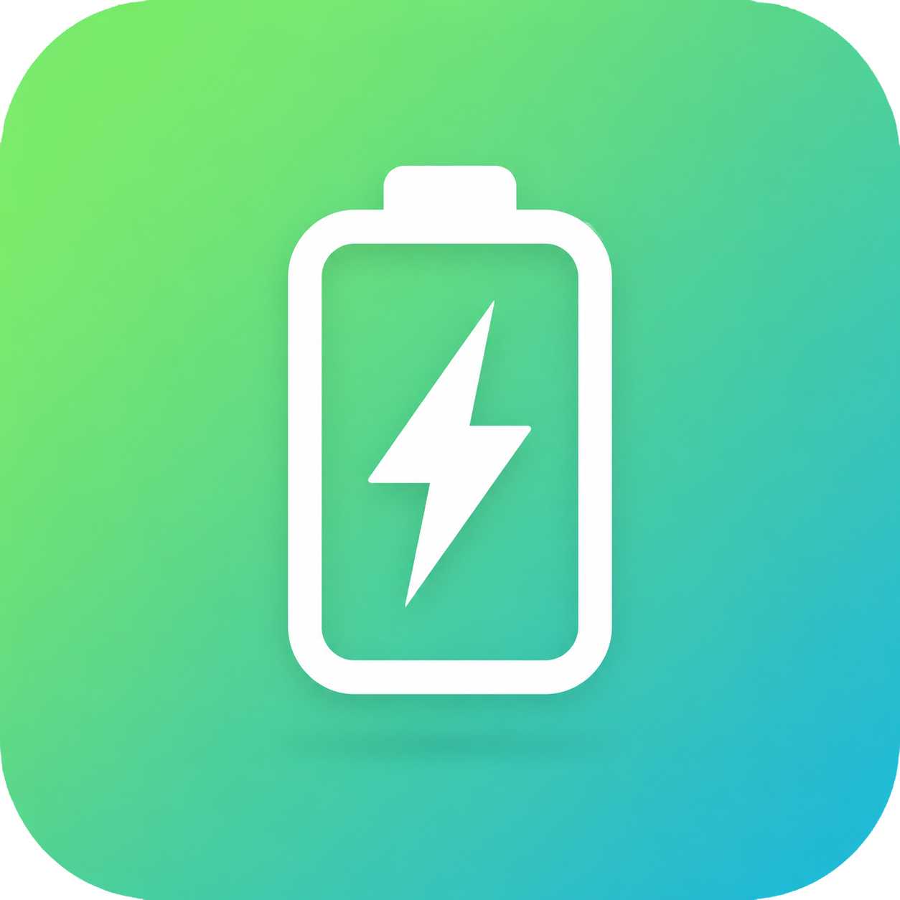
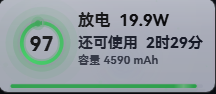

# Battery Monitor · 笔记本充电状态check

<p align="center">
  
</p>
<p align="center">
  <strong>Windows 电池状态悬浮窗</strong><br>
  PyQt6 打造 · 液态玻璃 UI · 四边圆角设计
</p>
<p align="center">
  
  
  
</p>

---

## 截图

| 浅色模式 | 深色模式 |
|:---:|:---:|
|  |  |

---

## ✨ 功能亮点

- **液态玻璃卡片** — 174×76 迷你悬浮窗，始终置顶
- **环形进度条** — 锥形渐变 + 三层辉光 + 前导光点
- **实时电量** — 百分比、功率 (W)、剩余/充满时间
- **电池总容量** — 毫安时 (mAh) 显示
- **底部电量条** — 带扫流动画
- **充放电识别** — 自动切换 | 充电提示音
- **充电呼吸光晕** — 卡片边缘脉动光效
- **动态粒子** — 颜色跟随电量变化
- **双主题** — 深色 / 浅色 / 跟随系统
- **鸿蒙字体** — HarmonyOS Sans SC Bold
- **鼠标穿透** — 点击穿透到下层窗口
- **屏幕磁吸** — 拖到边缘自动吸附
- **双击重置** — 双击回到右下角
- **电源计划** — 设置中一键切换 Windows 电源配置
- **开机自启** — 设置中开关

---

##  安装

### 下载预编译 Exe

从 [Releases](https://github.com/huangharen/BatteryMonitor/releases) 页面下载 `BatteryMonitor.exe`，双击运行即可。

> 无需安装 Python 或任何依赖.

---

##  使用方法

| 操作 | 说明 |
|------|------|
| **右键卡片** | 打开菜单：主题切换 / 鼠标穿透 / 允许拖动 / 设置 / 重启 / 退出 |
| **双击卡片** | 重置位置到屏幕右下角 |
| **拖拽卡片** | 需先在设置或菜单中开启"允许拖动" |
| **右键托盘图标** | 打开设置 / 重启 / 退出 |
| **磁吸边缘** | 松手时自动吸附到屏幕边缘（左/右/上/下） |

### 设置面板

- **主题模式** — 深色 / 浅色 / 跟随系统
- **鼠标穿透** — 开启后点击穿透到下层窗口
- **允许拖动** — 开启后可用鼠标拖拽悬浮窗
- **不透明度** — 滑块实时预览
- **开机自启** — 写入 `shell:startup`
- **电源配置选项** — 最佳能效 / 平衡 / 最佳性能

---

##  打包 Exe

```bash
pip install pyinstaller
pyinstaller --onefile --noconsole --name "BatteryMonitor" ^
    --icon "charge.png" ^
    --add-data "HarmonyOS_Sans_SC_Bold.ttf;." ^
    --add-data "charge.wav;." ^
    --add-data "charge.png;." ^
    --hidden-import psutil ^
    --hidden-import wmi ^
    --hidden-import ctypes ^
    --hidden-import ctypes.wintypes ^
    --hidden-import winreg ^
    --hidden-import win32com ^
    main.py
```

输出在 `dist/BatteryMonitor.exe`。

---

##  依赖

| 包 | 用途 |
|------|------|
| Python ≥ 3.12 | 运行时 |
| PyQt6 ≥ 6.5 | GUI 框架 |
| psutil ≥ 5.9 | 电池传感器数据 |
| wmi ≥ 1.5 | WMI 查询（健康度 / 容量） |
| pywin32 | COM 操作（开机自启快捷方式） |

---

##  项目结构

```
BatteryMonitor/
├── main.py                 # 入口 · 单实例 · 系统托盘
├── overlay_window.py       # 悬浮窗 UI · 绘制 · 设置对话框
├── battery_monitor.py      # 电池数据采集 · API 调用
├── settings.py             # JSON 配置持久化
├── HarmonyOS_Sans_SC_Bold.ttf  # 鸿蒙粗体字体
├── charge.png              # 应用图标
├── charge.wav              # 充电提示音效
├── requirements.txt        # Python 依赖
├── build_exe.bat           # 一键打包脚本
└── README.md               # 本文件
```

---

##  技术细节

- **数据源**：`CallNtPowerInformation` → 充放电状态 / 功率 / 容量 / 预估时间
- **二次回退**：psutil `sensors_battery()` → 基础电量数据
- **终极回退**：历史变化率线性回归 → 自力估算时间与功率
- **健康度 / 容量**：WMI `Win32_Battery` → 设计容量 / 当前容量 / 电压
- **玻璃效果**：6 层 QPainter 绘制（底色 / 阴影 / 色差 / 焦散 / 高光 / 镜面反射）
- **Win11 圆角**：DWM API `DWMWA_WINDOW_CORNER_PREFERENCE`

---

##  致谢

- [PyQt6](https://www.riverbankcomputing.com/software/pyqt/) — GUI 框架
- [psutil](https://github.com/giampaolo/psutil) — 系统传感器接口
- [HarmonyOS Sans](https://developer.harmonyos.com/cn/design/resource/) — 鸿蒙字体
- 灵感来自 Windows 11 Fluent Design

